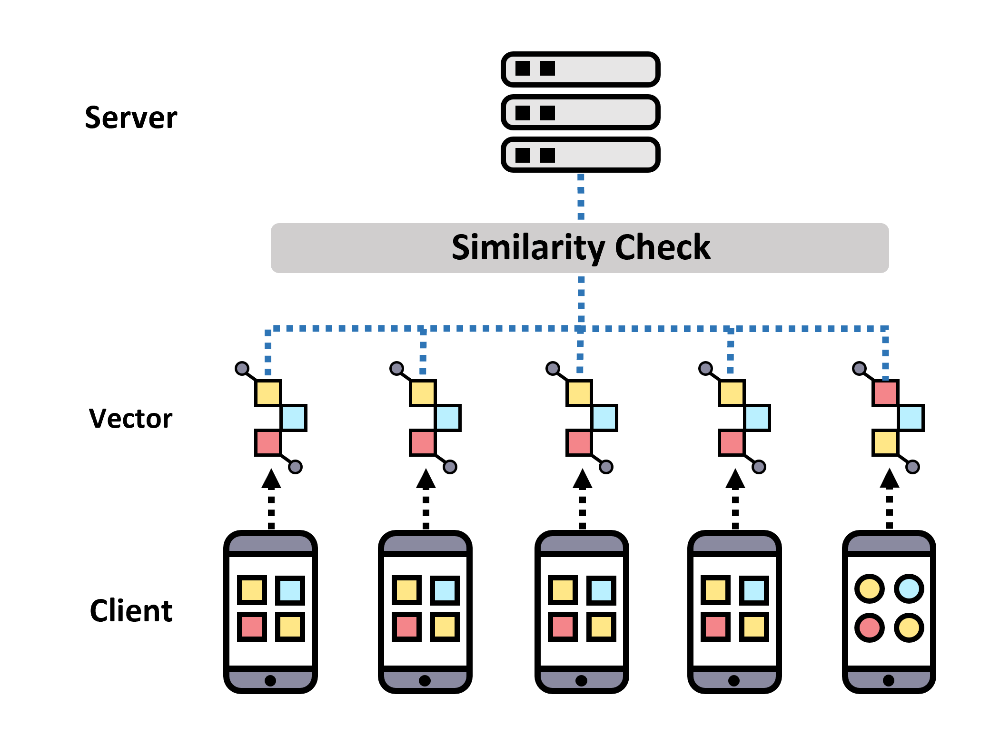

# Abnormal Client Detection Federated Learning Using Image Vectors

## Overview
Federated learning is a distributed machine learning system that can learn AI models in cooperation with each other without directly sharing data stored in multiple locations. Since federated learning requires training the model without direct access to the client data, AI models can be trained while protecting the client’s data. In the presence of clients with relatively different data distributions from other clients, this can lead to poor model learning performance in federated learning.
we propose a method to obtain cosine similarity by computing vector inner product based on the vector for the client’s image data, and to improve the performance of federated learning by eliminating clients with low similarity. Compared to the case of conducting federated learning without detecting abnormal clients, the performance improvement of 6% was confirmed when the proposed method was applied, and the federated learning was conducted.

## License
Copyright (c) 2022 Networking Intelligence
Redistribution and use in source and binary forms, with or without modification, are permitted provided that the following conditions are met:

1. Redistributions of source code must retain the above copyright notice, this list of conditions and the following disclaimer.

2. Redistributions in binary form must reproduce the above copyright notice, this list of conditions and the following disclaimer in the documentation and/or other materials provided with the distribution.

THIS SOFTWARE IS PROVIDED BY THE COPYRIGHT HOLDERS AND CONTRIBUTORS "AS IS" AND ANY EXPRESS OR IMPLIED WARRANTIES, INCLUDING, BUT NOT LIMITED TO, THE IMPLIED WARRANTIES OF MERCHANTABILITY AND FITNESS FOR A PARTICULAR PURPOSE ARE DISCLAIMED. IN NO EVENT SHALL THE COPYRIGHT HOLDER OR CONTRIBUTORS BE LIABLE FOR ANY DIRECT, INDIRECT, INCIDENTAL, SPECIAL, EXEMPLARY, OR CONSEQUENTIAL DAMAGES (INCLUDING, BUT NOT LIMITED TO, PROCUREMENT OF SUBSTITUTE GOODS OR SERVICES; LOSS OF USE, DATA, OR PROFITS; OR BUSINESS INTERRUPTION) HOWEVER CAUSED AND ON ANY THEORY OF LIABILITY, WHETHER IN CONTRACT, STRICT LIABILITY, OR TORT (INCLUDING NEGLIGENCE OR OTHERWISE) ARISING IN ANY WAY OUT OF THE USE OF THIS SOFTWARE, EVEN IF ADVISED OF THE POSSIBILITY OF SUCH DAMAGE.
